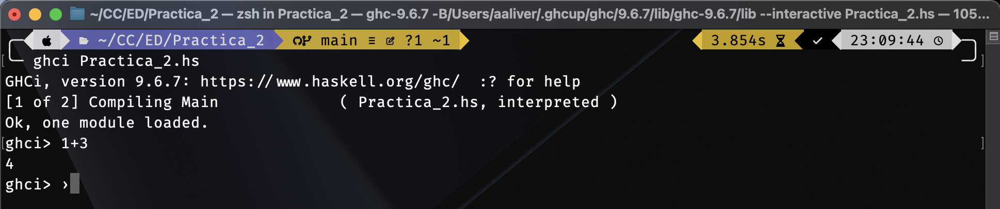

# Práctica 02: Introducción a Haskell

## Objetivo de la práctica

El objetivo de la Práctica 2 ha sido familiarizarnos con el entorno interactivo _ghci_ y sus funciones básicas, así como con Haskell y la sintaxis del lenguaje mediante el desarrollo de unas funciones básicas que usan operadores lógicos, tuplas, funciones y condicionales.

## Tiempo requerido en realizar la práctica completa

Completar la práctica 2 me ha tomado cerca de dos horas sin contar la media hora extra que me tomo arreglar el problema con los archivos .DS_Store en GitHub.

