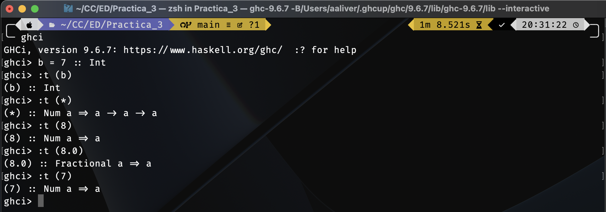

# Práctica 03: Tipos de datos y listas por comprensión

## Actividades de la Práctica

### ¿Cuál es la diferencia entre Num e Int?

> **Num** incluye todos los números, incluyendo números reales y enteros.

> **Int** representa enteros y está acotado, lo que significa que tiene un valor máximo y un valor mínimo (usualmente 32 bits).

### Referencias

- Lipovaca, M. (2011). Learn you A Haskell for great good: A beginner’s guide. No Starch Press.

## Objetivo de la práctica

El objetivo de la Práctica 3 ha sido conocer las Clases de tipo (TypeClass), crear nuestros propios tipos de datos y hacer uso de las Listas por compresión, así como conocer algunas palabra reservadas y funciones que seran de ayuda para todo lo anterior.

## Tiempo requerido en realizar la práctica completa

La Práctica 3 me ha tomado un total de 4 horas en completar.

